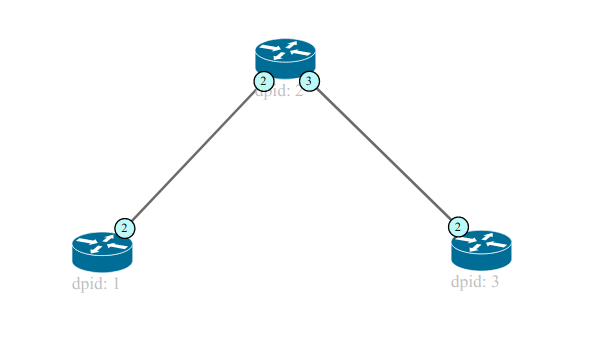
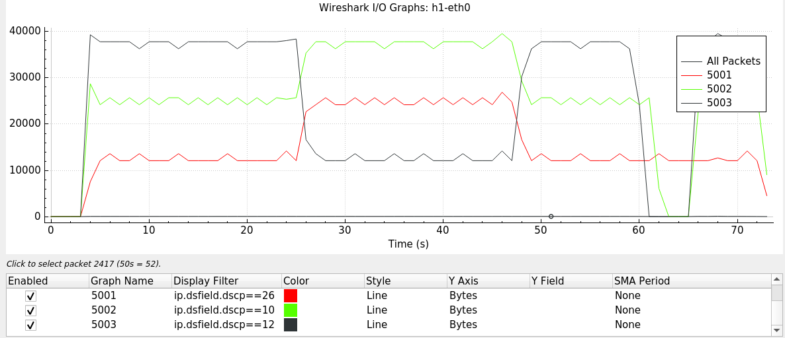

# PyconAR 2020 

## Como desarrollar un switch de capa 2 sobre un controlador SDN con Ryu framework


**Abstract:**
Las redes definidas por software (SDN) vienen a cambiar la forma en la que pensamos como las aplicaciones se vinculan con las redes sobre las que funcionan. En esta charla intentaré dar una breve introducción a la arquitectura y protocolos propuestos por SDN y como desarrollar nuevas funcionalidades de red usando un framework/controlador hecho en Python.

**Descripción:**
El objetivo de la charla es abordar los conceptos básicos de las redes definidas por software utilizando openflow como southbound interface y Open Virtual Switch (ovs) como elemento de red programable. Como ejemplo práctico, utilzaremos un framework para el desarrollo de aplicaciones SDN hecho en Python (Ryu) y veremos como desarrollar aplicaciones que implementen funcionalidades nuevas sobre nuestra red.

**Tabla de contenido**

- [Empezando](#empezando)
- [Ejemplos](#ejemplos)
    - [Switch L2](#switch-l2)
    - [Calidad de servicio](#calidad-de-servicio)
- [Referencias](#referencias)

### Requerimientos
Además de los requerimientos del repositorio, será necesario contar mininet.

### Comenzando
Clonar repositorio y (opcional) crear un virtualenv+virtualenvwrapper python para el manejo de dependencias

```bash
$ git clone https://github.com/joagonzalez/pyconar-2020
$ mkproject pyconar-2020
$ workon pyconar-2020
$ pip install -r requirements.txt
```

**Instalar controlador**
```baskh
git clone https://github.com/faucetsdn/ryu.git
cd ryu; pip install .

sed '/OFPFlowMod(/,/)/s/)/, table_id=1)/' ryu/ryu/app/simple_switch_13.py > ryu/ryu/app/qos_simple_switch_13.py
cd ryu; python setup.py install
```

**Instalar Mininet**
```bash
git clone git://github.com/mininet/mininet
cd mininet
git tag  # list available versions
git checkout -b 2.2.2
cd ..
mininet/util/install.sh [options]
```

### Ejemplos

#### Switch L2


Inicializar Mininet
```
sudo mn --topo=linear,3,1 --mac --switch ovsk --controller remote
sudo mn --topo=tree,3,3 --mac --switch ovsk --controller remote
```

Verificar flujos
```
sudo ovs-vsctl show
sudo ovs-ofctl dump-flows s1
h1 ping h3
wireshark &
```

Inicializar controlador

```
python3 ./bin/ryu-manager --observe-links ryu.app.rest_topology ryu.app.ws_topology ryu.app.ofctl_rest ryu.app.qos_simple_switch_13  ryu.app.rest_conf_switch ryu.app.rest_qos ryu.app.gui_topology.gui_topology
```

#### Calidad de servicio
Se simularan 3 hilos de comunicación desde H2 (client) y hacia H1 (server) con IPerf en los puertos 500[1-3] como se indica en el diagrama de la Figura 2. Cada hilo será marcado con un DSCP distinto en S2. Se crearán colas para establecer rate limits máximos distintos para cada hilo de comunicacion en S1 a través del API del controlador en runtime. Se intercambian los rate limits con el API para invertir los rate limits también en runtime. 


Inicializar controlador
```
python3 ./bin/ryu-manager --observe-links ryu.app.rest_topology ryu.app.ws_topology ryu.app.ofctl_rest ryu.app.qos_simple_switch_13  ryu.app.rest_conf_switch ryu.app.rest_qos ryu.app.gui_topology.gui_topology
```

Inicializar script
```
cd src/mininet
python sdn-simulation.py
```



### Referencias
- http://mininet.org/
- https://ryu-sdn.org/
- https://github.com/faucetsdn/ryu
- https://www.opennetworking.org/
- https://iperf.fr/ 


